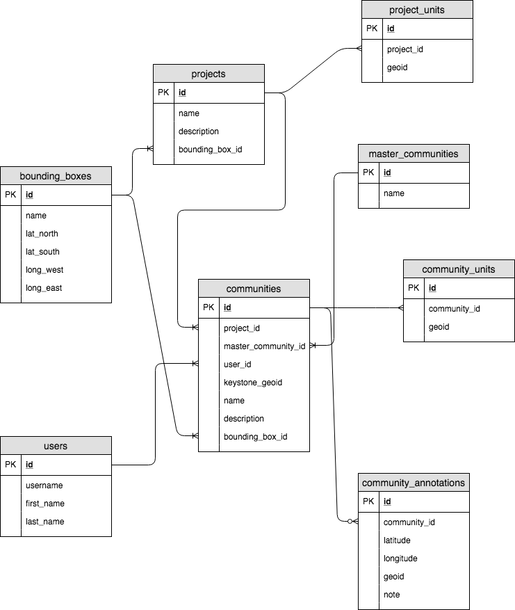
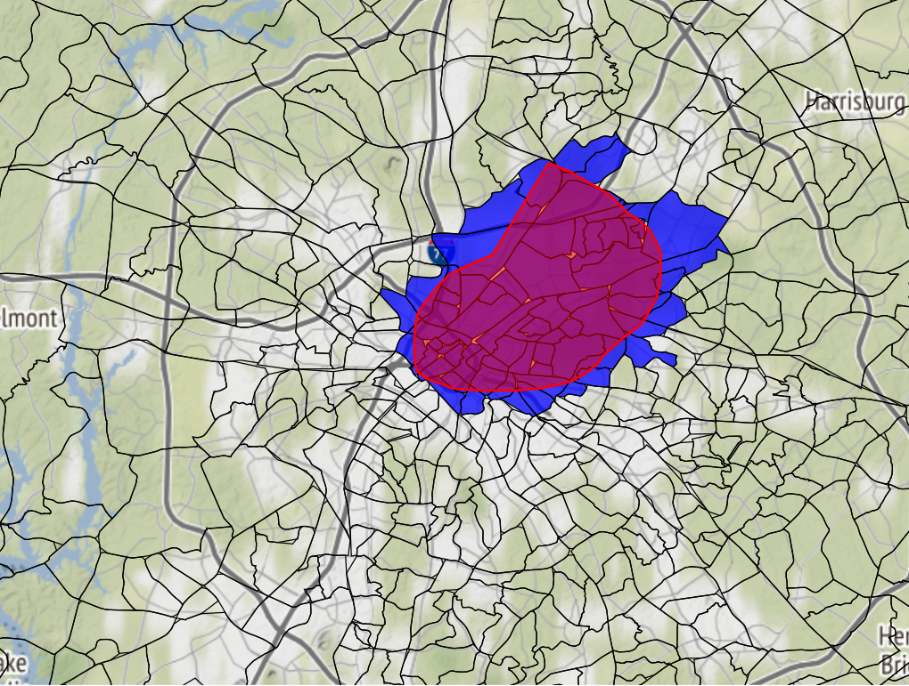

# community-builder

## Overview

Community Builder is a lightweight tool to facilitate information gathering around communities of interest, during the redistricting process. Community members will be able to draw their own proposed communities, and annotate them with specific points and notes. Redistricting commissions or consultants will then be able to view and consider these communities, and export them in a variety of formats for use in other tools.

### Project Justification

Several tools exist, such as DistrictBuilder, that enable similar functionality for the redistricting authorities themselves. However, these products have a lot of overhead, needing to calculate scoring metrics, enforce legal constraints, and provide maximum flexibility for expert users.

Our goal here is to provide the minimal tooling needed to enable community drawing by community members. The system must be run in browser with no client-side software, to maximize ease for the user-base, regardless of whether they are a power-user, or relying on the internet connection at the local library.

## Data Model

### Terminology

- **User:** A stakeholder in the project, currently only those who would be drawing 
- **Unit:** A single census-coded region, identified by FIPS code. The current version uses block groups, but this will likely be blocks for most projects.
- **Project:** A single redistricting effort, such as North Carolina Congressional, or Seattle City Council. Project units are specified to limit the region in which communities can be drawn.
- **Community:** A single region, drawn by a User within a Project, and made up of units.
- **Master Community:** If multiple Community drawings are deemed to be various specific versions of the same overall Community, they may be associated with a single Master Community
- **Annotation:** Annotations are details about specific points within a drawn Community. The User may want to note a building they consider the conceptual core of the community, or a location on the edge that they feel it is important the boundary includes.

## Features

### Community Members

Community members wishing to annotate their own communities will be able to:

- Select a project to interact with (such as North Carolina Congressional)
- Draw a new community, as a polygon on the map, which will be converted to a subset of map units.
- Toggle individual units on the map to refine the edges.
- Annotate the community, attaching notes to specific points.
- Save the community with a name and a description
- Associate with a master community—the interface will perform string matching on the name, and detect geographically similar locations, to provide suggestions.

Possible, but non-essential, future features include:

- Search and view communities drawn by other users
- Upvote or comment on other communities
- View aggregated census demographics on the community they have created

### Administrators

Site admins, including commission members, redistricting consultants, and other managers of community drawing projects, will be able to:

- Create a new project, with a specified outer geometry, such as a given state, city, etc.
- View created communities associated with a project, and their annotations
- View and compare multiple variations on a single master community, and reconcile them to a single consensus.
- Export to various shapefile formats for use in other applications.

## Application Components

### Leaflet Front-End

### Python Flask API

### Relational Database

The relational structure is currently stored in MySQL on AWS. However, this will most likely change to PostGIS to incorporate easier spatial calculation.

## Project Roadmap

### Stakeholder Review

Prior to moving forward with a fully architected and functional product, developers should take a step back and conduct user research on what tooling is needed. Research should include:

- Redistricting experts, with experience defining communities of interest, such as members of the CA commission
- Public planners, with experience working on community drawing exercises
- Community members that may be interested in using the tool.

### Software Review

Many decisions were made hastily for purposes of the hackathon. Informed decisions should be made on the following:

- **DBMS:** This will most likely be PostGIS, but some confirmatory research should be performed.
- **Front-End:** Determine what javascript library is best suited for the use case
- **API:** Decide between Flask, NodeJS or other options for building the server-side API

### Build the Thing

Then lets build the thing.